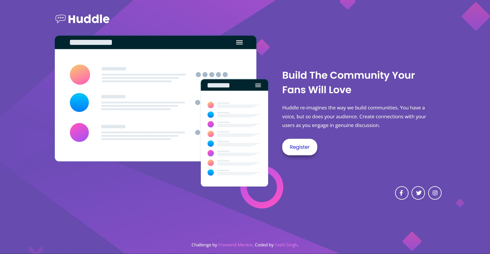

# Huddle landing page with single introductory section solution

## Overview

### The challenge

Users should be able to:

- View the optimal layout for the page depending on their device's screen size
- See hover states for all interactive elements on the page

### Screenshot

##### Desktop Screenshot


##### mobile Screenshot


## My process

### Built with

- Semantic HTML5 markup
- CSS custom properties
- Flexbox
- CSS Grid
- Mobile-first workflow
- [Open Sans](https://fonts.google.com/specimen/Open+Sans) and [Poppins](https://fonts.google.com/specimen/Poppins) - Fonts
- [Font Awesome](https://fontawesome.com/) - For icons

### What I learned

While working on this project, I learned how to effectively use CSS custom properties for color management and how to implement responsive design using media queries. I also improved my skills in creating hover effects for interactive elements.

For example, I created a hover effect for the social media icons:

```css
.social a i:hover::after {
    border-color: var(--soft-magenta);
}
```

### Continued development

In future projects, I plan to explore advanced CSS techniques such as animations and transitions to enhance user interactions further. I also want to deepen my understanding of responsive design to handle more complex layouts and scenarios.

### Useful resources

- [CSS Tricks: A Complete Guide to Flexbox](https://css-tricks.com/snippets/css/a-guide-to-flexbox/) - A great resource for understanding Flexbox layout.
- [MDN Web Docs: Media Queries](https://developer.mozilla.org/en-US/docs/Web/CSS/Media_Queries/Using_media_queries) - Helpful documentation on using media queries for responsive design.