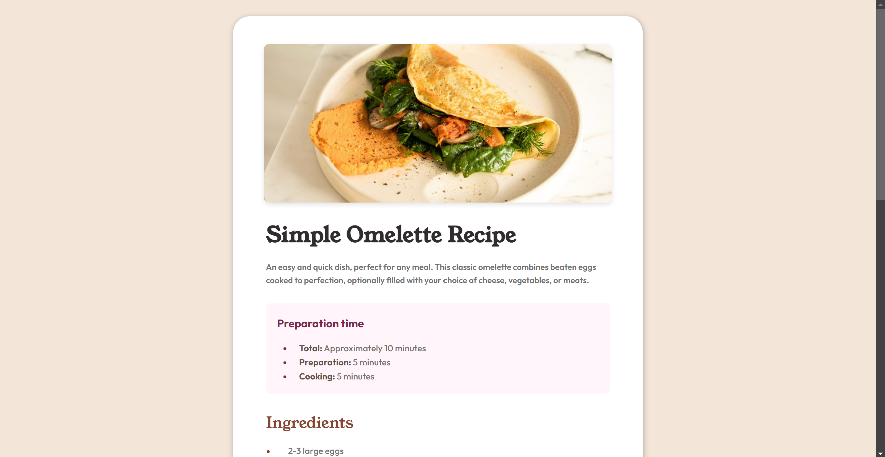
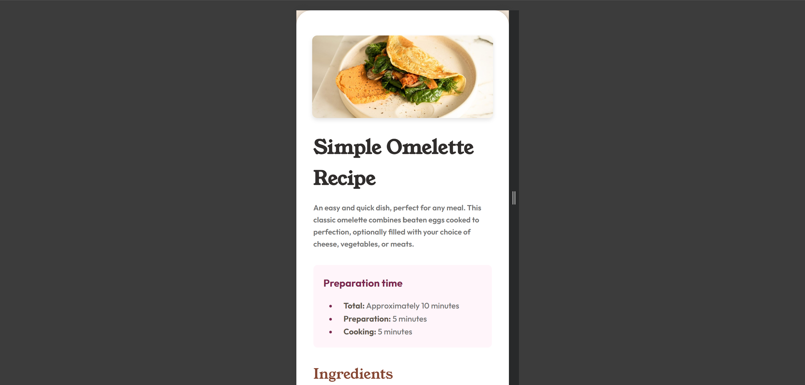

# Recipe Page Solution

## Overview

### The challenge

Users should be able to:

- View the recipe page with a clean and responsive design
- See the preparation time, ingredients, instructions, and nutritional values clearly
- View an image of the dish

### Screenshot






## My process

### Built with

- Semantic HTML5 markup
- CSS custom properties
- Flexbox
- Mobile-first workflow

### What I learned

Working on this project helped me reinforce my understanding of:

- **CSS Custom Properties**: Using variables for consistent styling across the project.
- **Flexbox**: Aligning and distributing space among items in a container.
- **Responsive Design**: Ensuring the layout adapts well to different screen sizes using media queries.

Code snippets I’m proud of:

```html
<figure>
    
</figure>
```

```css
body {
    margin: 0;
    padding: 0;
    font-family: 'Young Serif', serif; 
    background-color: var(--stone-100);
    line-height: 1.6;
    font-size: 16px;
    display: flex;
    flex-direction: column; 
    align-items: center;
    min-height: 100vh;
}
```

```css
.instructions-steps li::before {
    content: counter(list-counter) ". ";
    color: hsl(14, 45%, 36%);
    position: absolute;
    left: -30px;
    top: 0;
    font-weight: 700;
}
```

### Continued development

In future projects, I aim to:

- **Explore CSS Grid**: For more complex layouts and design patterns.
- **Improve Accessibility**: By testing and enhancing the accessibility features of the website.
- **Experiment with JavaScript**: To add interactive elements and dynamic content.

### Useful resources

- [CSS Tricks Flexbox Guide](https://css-tricks.com/snippets/css/a-guide-to-flexbox/) - This guide was essential in understanding Flexbox.
- [MDN Web Docs on Media Queries](https://developer.mozilla.org/en-US/docs/Web/CSS/Media_Queries/Using_media_queries) - Helpful for implementing responsive design.
