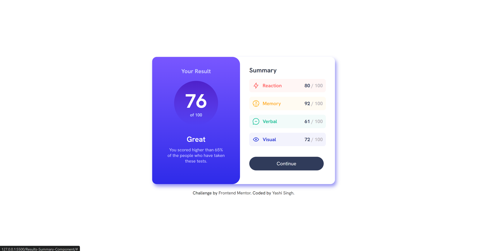
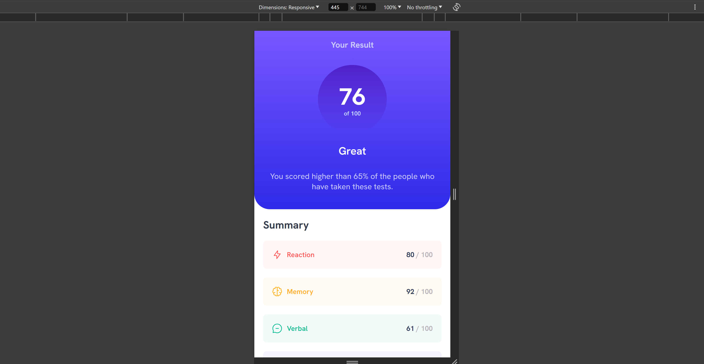

# Results summary component solution

## Table of contents

- [Overview](#overview)
  - [The challenge](#the-challenge)
  - [Screenshot](#screenshot)
  - [Links](#links)
- [Installation](#installation)
- [My process](#my-process)
  - [Built with](#built-with)
  - [What I learned](#what-i-learned)
- [Support](#support)
- [Roadmap](#roadmap)
- [Contributing](#contributing)
- [Authors and Acknowledgment](#authors-and-acknowledgment)

## Overview

### The challenge

Hey there! I build a results summary component using just HTML and CSS. The key is to make sure it looks great on any screen size, so it's super important to nail that responsive design. Oh, and don't forget those hover effects—they really make things pop! Ready to create a slick, interactive interface? Let's do this!

### Screenshot

Desktop Preview



Mobile Preview




## My process

### Built with

- Semantic HTML5 markup
- CSS custom properties
- Flexbox
- Mobile-first workflow
- External dependencies:
  - Google Fonts: Imported 'Hanken Grotesk' font via URL in CSS for typography.
  - Local Images: Utilized `` tags with local image sources (image/icon-reaction.svg, etc.) for graphical content.

### What I learned

Working on this project has been a great learning experience, and here are some key takeaways:

#### Semantic HTML5 Markup

Using semantic elements like `<section>`, `<div>`, `<h3>`, and `<p>` helped me structure the content meaningfully. Here's an example of how I used semantic elements effectively:

```
<section class="summary">
  <h3>Summary</h3>
  <!-- Other semantic elements used here -->
</section>
```

#### CSS Custom Properties (Variables)

CSS custom properties (--variables) proved invaluable for maintaining consistent styling across the project. Here's how I defined and used them:

<pre>
:root {
  --light-red: hsl(0, 100%, 67%);
  --orangey-yellow: hsl(39, 100%, 56%);
  /* Define other variables */
}

.result .great {
  color: var(--orangey-yellow);
}
</pre>

#### Flexbox for Responsive Layouts

Flexbox (display: flex) was crucial for creating flexible layouts, especially within the .container and .result sections. It simplified alignment and distribution of elements:

<pre>
.container {
  display: flex;
  flex-direction: column;
  justify-content: center;
  align-items: center;
}

.result {
  flex: 1;
  text-align: center;
}
</pre>

#### Media Queries for Mobile-First Design

Implementing media queries (@media (max-width: 630px)) ensured the design was responsive and optimized for various screen sizes. Here's how I adjusted styles for smaller screens:
<pre>
@media (max-width: 630px) {
  .result .score {
    width: 35vw;
    height: 35vw;
  }
  
  /* Other responsive adjustments */
}
</pre>

#### External Dependencies Management

Integrating Google Fonts and local images (`` tags) required understanding how to link external resources and optimize loading times:

```
<link rel="stylesheet" href="https://fonts.googleapis.com/css2?family=Hanken+Grotesk:ital,wght@0,100..900;1,100..900&display=swap">


```

These learnings have not only improved my understanding of front-end development but also enhanced my ability to create responsive, visually appealing web interfaces using modern HTML and CSS techniques.


## Roadmap

- **Add Animations:** Introduce subtle animations to enhance user experience.
- **Expand Accessibility:** Improve the component's accessibility for users with disabilities.
- **Refactor Code:** Optimize and clean up the CSS for better performance.

## Contributing
Contributions are welcome! If you'd like to contribute, please fork the repository and create a pull request with your changes. Before submitting, ensure your code adheres to the project's style and has been tested thoroughly.

1. Fork the repository.
2. Create a new branch: `git checkout -b feature-branch-name`
3. Commit your changes: `git commit -m 'Add some feature'`
4. Push to the branch: `git push origin feature-branch-name`
5. Open a pull request.

