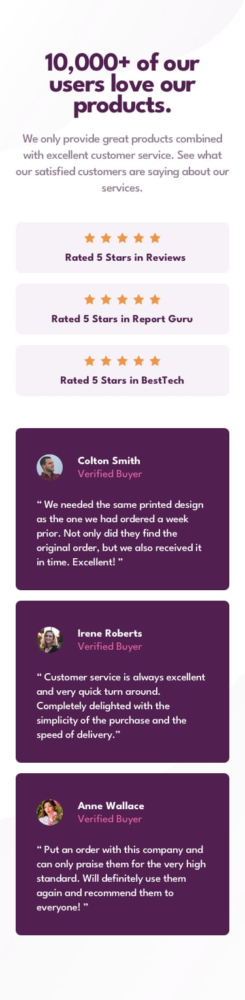

# Social Proof Section Solution

## Overview

### The Challenge

Users should be able to:

- View the optimal layout for the section depending on their device's screen size
- See a responsive layout that adapts from desktop to mobile

### Screenshot

#### Desktop Preview


#### Mobile Preview



## My Process

### Built With

- Semantic HTML5 markup
- CSS custom properties
- Flexbox
- Mobile-first workflow

### What I Learned

This challenge helped solidify my understanding of **responsive design** and **flexbox layouts**. Here's a snippet of CSS I'm particularly proud of:

```css
.container {
    width: 100%;
    display: flex;
    flex-direction: column;
    justify-content: center;
    align-items: center;
    gap: 30px;
}
```

This block helped me manage the responsiveness of the layout, ensuring a flexible structure for different screen sizes.

### Continued Development

Moving forward, I plan to:

- Refine my CSS Grid skills
- Continue practicing responsive design for more complex layouts
- Explore using JavaScript to add interactive elements to similar projects

### Useful Resources

- [CSS Flexbox Guide](https://css-tricks.com/snippets/css/a-guide-to-flexbox/) - A great resource that helped me master flexbox for responsive layouts.
- [MDN Web Docs on Media Queries](https://developer.mozilla.org/en-US/docs/Web/CSS/Media_Queries/Using_media_queries) - This documentation was helpful for ensuring the layout adapts correctly across devices.

## Style Guide

For the style guidance refer to [Style Guide](style-guide.md)